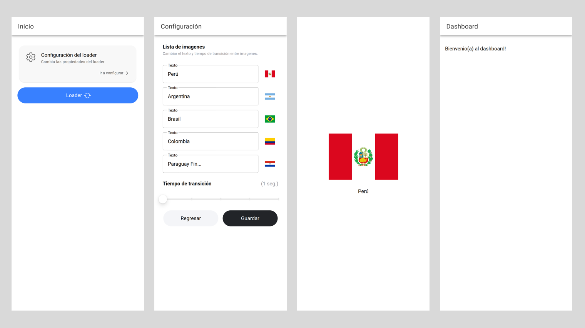

  

<h1 align="center">
  Ionic
</h1>

### Dependecias

Este proyecto tiene las siguientes dependencias.

* **Angular ^17.0.2**
* **Ionic ^7.5.0**

### Comandos

Al clonar este proyecto utiliza los siguientes comandos:

* **npm i** (Instala las dependencias)
* **ionic serve** | Levanta en: http://localhost:8100/home

### Resultado
